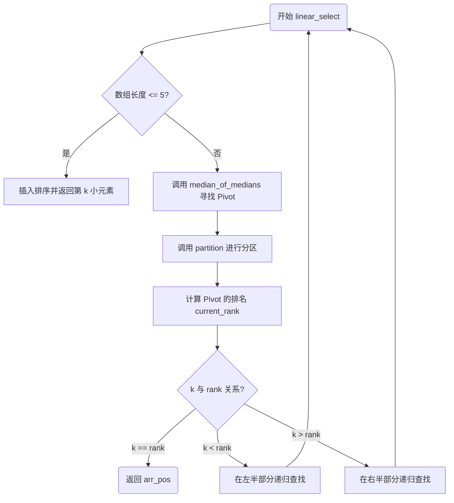
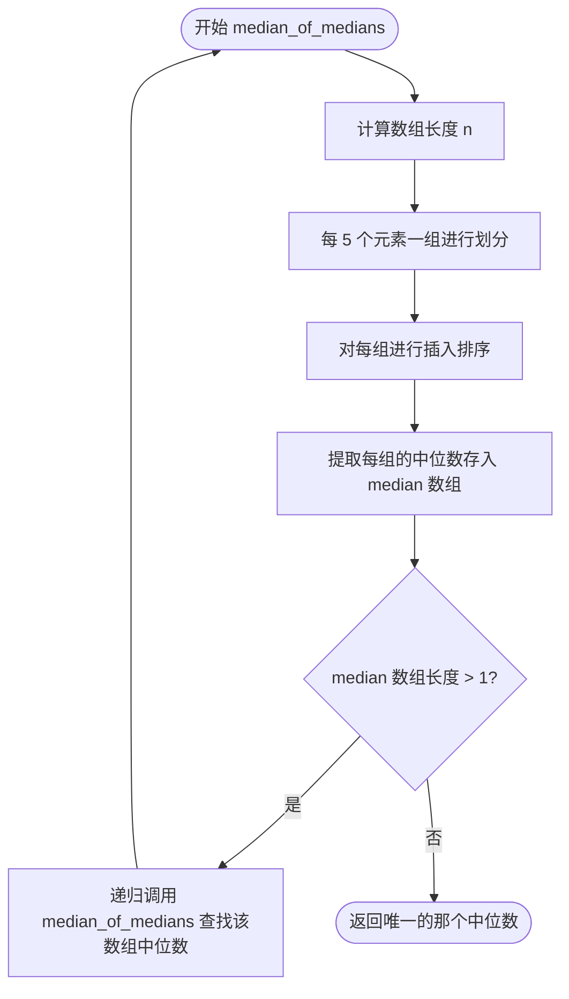
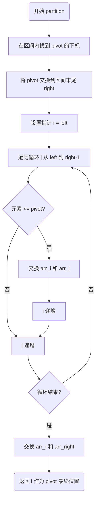

# 线性时间选择问题 - BFPRT算法实现

## 题目说明

给定线性序集中n个元素和一个整数k，1≤k≤n，要求使用二次取中法（Median of Medians，又称BFPRT算法）在线性时间内找出这n个元素中第k小的元素。

## 算法简介

BFPRT算法（又称 Median of Medians，中位数的中位数算法）。它的核心价值在于能在最坏情况下以 $O(n)$ 的时间复杂度找到数组中第 $k$ 小的元素。

### 算法核心思想

1. **二次取中法（Median of Medians）**：通过分组取中位数，再取中位数的中位数，确保找到一个好的pivot
2. **分区（Partition）**：使用pivot将数组分为两部分
3. **递归选择**：根据k与pivot位置的关系，决定在左半部分、右半部分递归，或直接返回

### 整体选择流程 (linear_select)

这是主控逻辑，决定了是直接排序返回，还是通过寻找 Pivot 进行递归分区。

### 二次取中逻辑(median_of_medians)

这是该算法保证 $O(n)$ 复杂度的核心，通过分组取中位数来确保 Pivot 能够较好地划分数组。

**为什么选择5个元素一组？**

- 如果组太小（如3），递归深度会增加
- 如果组太大（如7），虽然递归深度减少，但每组排序的开销会增加
- 5是经过数学证明的最优选择，能保证最坏情况下O(n)的时间复杂度

### 分区算法 (partition)

该函数利用选定的 Pivot 将数组划分为左右两边，是经典的快速选择/快排变体。

**算法步骤：**
1. 找到pivot在数组中的位置，并将其交换到数组末尾
2. 使用双指针技术进行分区（Lomuto分区方案）
3. 将pivot从末尾交换回正确位置

### 关键复杂度分析

该算法之所以高效，是因为它通过以下递推公式保证了最坏情况下的线性时间：

$$T(n) \leq T(n/5) + T(7n/10) + O(n)$$

- **$T(n/5)$**: 寻找"中位数的中位数"所需的开销
- **$T(7n/10)$**: 分区后，最坏情况下剩余需要处理的元素比例（pivot至少能排除30%的元素）
- **$O(n)$**: 插入排序（小规模）和分区遍历的常数开销

通过数学证明，这个递推式的解是 $O(n)$，因此算法在最坏情况下也能保证线性时间复杂度。

## 测试用例

程序包含以下测试用例：

1. **基础测试**：基本数组测试
2. **已排序数组**：测试已排序数组的处理
3. **逆序数组**：测试逆序数组的处理
4. **重复元素**：测试包含重复元素的数组
5. **边界情况**：单个元素、两个元素等边界情况
6. **极值查找**：查找最小值和最大值
7. **中等规模**：50个元素的数组测试
8. **随机测试**：不同规模的随机数组测试（100, 500, 1000, 5000, 10000个元素）

## 算法特点

### 优点

1. **最坏情况O(n)时间复杂度**：相比快速选择的O(n²)最坏情况，BFPRT算法保证线性时间
2. **确定性算法**：不依赖随机性，结果可重现
3. **稳定性好**：在各种输入情况下性能稳定

### 缺点

1. **常数因子较大**：虽然时间复杂度是O(n)，但常数因子比快速选择大
2. **实现复杂**：需要实现median_of_medians和partition两个核心函数
3. **对小数组可能不如简单排序快**：对于很小的数组，直接排序可能更快

## 代码注释说明

代码中包含了详细的注释，说明：

- **函数功能**：每个函数的作用和参数说明
- **算法步骤**：关键算法的详细步骤说明
- **复杂度分析**：时间复杂度和空间复杂度的分析
- **设计决策**：为什么选择某些实现方式（如为什么选择5个元素一组）
- **边界情况**：如何处理各种边界情况

## 性能分析

通过测试报告可以观察到：

- **小数组**（n ≤ 5）：直接使用插入排序，耗时接近0ms
- **中等数组**（n = 10-50）：耗时在0.001-0.01ms之间
- **大数组**（n = 1000-10000）：耗时随n线性增长，验证了O(n)的时间复杂度
